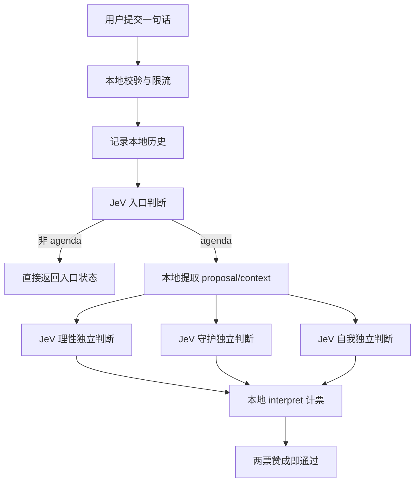

# 三相议决 TRIAD

超高智能个人即时决策系统。手机优先的私人终端网页，接入真实 Jev，规则与角色配置 v0.74。

当前规则冻结基线为 [v0.74](/Users/xavier/Desktop/超高智能个人即时决策系统/FREEZE-v0.74.md)，历史验收基线见 [v0.57](/Users/xavier/Desktop/超高智能个人即时决策系统/FREEZE-v0.57.md)。v0.74 在 v0.73 的短句情绪与事实边界基础上，补强了“我可以……”行动问句和“想 A 也想 B”多选结构。测试记录见 [SHORT-INPUT-REPORT-v0.74.md](/Users/xavier/Desktop/超高智能个人即时决策系统/SHORT-INPUT-REPORT-v0.74.md)。

v0.75 端到端验收轮已通过：60 条混合议案各提交 3 次，共 180 次真实 Jev 联动请求；入口路线、三角色票型和最终多数裁决均无不稳定，记录见 [E2E-ACCEPTANCE-v0.75.md](/Users/xavier/Desktop/超高智能个人即时决策系统/E2E-ACCEPTANCE-v0.75.md)。v0.75 是验收轮编号，角色配置仍为 v0.74。

网页端验收也已通过：正常议案、情绪输入、多选输入、议案记录和 CRT 开关均完成真实浏览器操作；第二单元后台角色为 guardian，界面有意使用主题化别名“存续 / CONTINUITY”，记录见 [UI-ACCEPTANCE-v0.75.md](/Users/xavier/Desktop/超高智能个人即时决策系统/UI-ACCEPTANCE-v0.75.md)。

## 启动

需要 Node.js 22 或更新版本，无第三方运行依赖。双击「启动终端.command」，或在本目录运行 `npm start`。保持启动窗口打开。

电脑打开 http://localhost:4317 。手机与电脑连接同一 Wi-Fi，在 Safari 打开启动窗口中显示的局域网网址。若无法访问，请检查系统防火墙与 Wi-Fi 客户端隔离；电脑休眠或停止服务后网页无法提交。当前为本地原型，没有发布公共网址。

## 密钥

本机 `.env.local` 仅指向原有密钥文件，密钥没有复制到项目。迁移项目到其他电脑时，参考 `.env.example` 配置 `TYPESAFE_KEY_FILE`，或在服务端环境设置 `TYPESAFE_API_KEY`。不要把密钥放进 public/。

## 规则

同一 Jev 模型分别评估理性、守护和自我，三个角色各自独立请求、互不锚定。概率大于 0.5 投是，否则投否，至少两票是即通过。无暂缓票。缺失或异常响应不会计票。服务端只向浏览器返回票型和裁决，不返回概率、角色指令或密钥。

模型输入同时包含一组入口语义属性（个人方向、行动主体、选择数量、事实/情绪/自我价值信号和安全情境），Node 根据属性合成为议案、感受、多选项、知识、自我价值、危机、伤害他人与指代不明八类；旧的 entry Choice 仍作为兼容降级。只有「议案」进入投票，其余类别直接返回各自的入口状态，不会成为额外投票。

一句话是默认输入方式，不要求用户先写完整背景。中文口语省略主语时，明确的日常行动或边界（如「今天去跑步」「先休息一天」）按用户本人的方向理解；只有泛化动词且没有对象或指代（如「我应该去吗」「要不要做」）才归为 `unclear`。只陈述代价、影响或事实（如「购买会影响基本食物支出」）不会自动进入投票；如果事实背景后继续表达用户自己是否要做、接受或拒绝（如「购买会影响基本食物支出，但我还要买吗？」），则按个人议案处理。只有感受、事实问题或多个独立选择仍不会进入投票。

进入投票的议案会先在本地提取唯一表决对象（`proposal`）与背景（`context`），并标记对象来源：`explicit`（明确问句或意愿）、`implied`（可读出的隐含方向）或 `unclear`（仍缺少指代）。长背景后的句尾问句（如「这工作我还接吗」「这婚我还结吗」）会提取句尾动作，前面的经历和条件保留为 `context`。这些字段只传给后台角色，不展示角色思考过程；角色只判断 `proposal`，不从原文重新猜测对象。

正常议案会产生四次 Jev 调用：第一次同时做入口属性、活动场景/紧急性、安全情境、议案表达清晰度和决策画像分类，随后理性、守护、自我各自独立调用一次，后三次并行执行。需要及时就医但不是危机的输入仍可作为议案进入投票；自伤、他伤或迫切现实危险会先进入照护流程。非议案输入只完成入口调用，不进入角色投票。

服务端会随议案附带结构化的本地时间（日期、星期、时段、是否周末、是否深夜），供角色评估现实得失与安全风险（如“现在去看海吗”）。对于“深夜 + 明确户外或出行 + 非紧急”的高确定性组合，后台会强制理性和守护投否；急救、急诊、危险、赶航班等必要行动不触发这条约束。时间由终端实时生成，不来自用户输入。

活动场景和紧急性由入口阶段的 activity 语义问题统一判断，运行时不再维护“看海/医院/开车”等地点或动作词表。入口还会生成共享的 proposalClarity（表决对象是否清晰）、decisionProfile（可逆性、财务影响、身体风险、现实必要性）和 pressureContext（普通社交压力或胁迫/报复风险），三个角色读取同一份画像再分别判断；当画像明确显示会威胁基本生活时，服务端会在计票前固定理性和守护投否。resolveProposal 中仍保留一小段句法兜底词表，但它只给内部 proposalMode 做“隐含方向”标记，不决定入口类别、活动属性或最终票型；新增活动不应修改这段词表。

本地服务提供三个接口：`POST /api/decide` 提交议案，`GET /api/health` 查看 Jev 配置和规则版本，`GET /api/history?session=...` 读取当前浏览器会话的本地历史。默认每个来源一分钟最多 12 次请求，同时最多处理 3 个判断；批量测试可临时设置 `LOCAL_REQUEST_LIMIT`，生产环境保持默认值即可。

## 隐私与部署范围

用户输入会发送到 TypeSafe 供判断。每个有效提交的议案会追加保存到本机 `data/question-history.txt`，用于点击 TRIAD 标题后查看当前浏览器会话的记录；记录包含提交时间、会话标识和议案正文，不包含 Key 或模型原始返回值。该目录已由 git 忽略，不会进入仓库。内存中仅保留短时限流时间戳。未引入第三方字体、统计脚本或追踪资源。界面使用随项目携带的本地字体子集 `public/eva-ming-sc-subset-v2.woff2`（Eva Ming SC，覆盖界面文字与 GB2312 一、二级字库共 6763 字）。如需重建：重新获取原始字体 Eva Ming SC 后，`pip install fonttools brotli` 并用 `pyftsubset` 按根目录的 `subset-chars.txt`、`common-chars.txt`、`common-chars-2.txt` 字符清单子集化，产物改名带版本号以避开不可变缓存。

当前服务默认绑定所有网卡以便手机体验；配有基本的请求大小检查、同源检查和限流。线上部署(HTTPS、Nginx 反代、PM2 守护、Let's Encrypt 自动续期、每 IP 每日 23 次公共配额)见 `deploy/DEPLOY.md`。无需数据库。

## 文件

- public/：界面、交互、图标与本地字体子集。sound.js 只提供未来音效适配入口，没有实际音频或开关。
- roles.json：测试确定的三个角色配置，含公共开场白与分类化判定条款。
- decision.mjs：入口语义属性与兼容路由、活动/安全/决策画像定义、单句议案解析（proposal/context/mode）、结果校验与多数计票。
- server.mjs：静态页面、入口与三角色 Jev 调用、限流和历史记录；decision.mjs 与 roles.json 按 mtime 热重载，改完即生效，无需重启。
- test/：计票、入口属性合成、活动/安全门、单句解析和异常结果验证；运行 `npm test`。`test/fixtures/` 保存 60 条入口样本、两组对抗样本、角色批次和单句批次，便于复跑真实 Jev 联动。

## 视觉与适配

琥珀磷光的黑褐终端，四角切角卡片。以 440 CSS px 宽的大屏 iPhone 竖屏为首要设计视口，同时适配更窄手机及桌面；任意窗口尺寸下页面不产生上下滚动，议会卡片随可用空间弹性伸缩。使用安全区内边距及 reduced-motion 支持；实际 Safari 地址栏与字体渲染仍以真机体验为准。

颜色语义：琥珀为待命与判断中，绿为「是」，红为「否」，暖灰为「未表决」（无效输入或关怀拦截，未进入投票）。

字体：英文与数字走系统等宽字体（Menlo / Cascadia Mono），中文使用随项目携带的 Eva Ming SC 子集，票型大字同用明体。

CRT 效果由左下角开关控制，仅关闭屏幕拟真层（扫描线、辉光、晕影、扫描光带、指示灯呼吸）；打字光标等界面动画保留。手机端不显示点状噪点，以保护小字号文字的可读性。

动效：背景电路连线有能量流，中心节点为旋转虚线环、呼吸核心与雷达涟漪（HTML 绘制，不随拉伸变形）；输入框的 `>` 提示符在未聚焦时缓慢呼吸漂移、聚焦后停驻；提交按钮为回车符号。议案提交后三票依次翻牌揭示，未表决与通过/否决采用同一演出节奏。

## 来源与边界

结构参考 hide-G/magi-system-on-jev 的三视角多数投票概念；本项目代码独立编写，没有复制其未明确许可的源代码或素材。Jev 接口依据 TypeSafe 官方文档。原型不代表官方 EVA 或银翼杀手产品。
