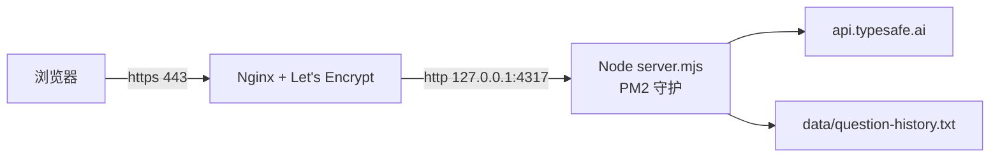

# 部署指南 — 阿里云轻量应用服务器(ECS 同样适用)

目标架构:浏览器 → Nginx(443,HTTPS)→ 本机 Node(127.0.0.1:4317,PM2 守护)→ TypeSafe API。4317 端口永不对外。



## 前提条件(先做,缺一不可)

1. **轻量应用服务器实例**:建议规格 2G 内存及以上(项目零第三方依赖,占用很小)。
2. **选对镜像**:创建/重装实例时选**系统镜像**——Ubuntu 22.04、Debian 12 或 Alibaba Cloud Linux 3 均可。**不要选 LNMP/LAMP 应用镜像**(自带旧版 Nginx 会和脚本安装的冲突)。
3. **域名解析**:在你的 DNS 服务商把域名 A 记录指向轻量服务器公网 IP,等 1~10 分钟生效。
4. **放行端口(轻量服务器的关键)**:轻量服务器不用 ECS 的「安全组」,而是控制台的「防火墙」页——在那里**放行 TCP 80 与 443**。4317 不要放行。这是最常见的坑:系统里 Nginx 配置全对,但控制台防火墙没放行,外部就是访问不了。
5. **备案(大陆地域)**:域名解析到中国大陆地域服务器必须先完成 ICP 备案,否则阿里云会拦截 80/443 访问。不想备案可把轻量服务器开在香港/新加坡地域(跨境延迟略高)。备案一般需要数天到数周,建议先并行发起。

## 部署(推荐:一键脚本)

```bash
# 服务器上,先克隆仓库(或上传代码)
git clone https://github.com/Xavierrrr23/triad-personal-decision-terminal.git
cd triad-personal-decision-terminal

# 运行部署脚本(把域名换成你的)
sudo bash deploy/setup.sh triad.example.com your@email.com
```

脚本流程:装依赖 → 装 Node 22 → 拉代码 → 生成 `.env.local`(提示你填入 `TYPESAFE_API_KEY`,填好后重跑脚本)→ 跑测试 → PM2 启动 → Nginx 站点 → certbot 签发 HTTPS。

脚本会自动适配你实例的系统:Ubuntu/Debian 走 `apt`,Alibaba Cloud Linux 走 `dnf/yum`,Nginx 站点配置也会放到对应目录(`sites-enabled` 或 `conf.d`)。

完成即得 `https://你的域名`。

## 手动部署(想逐步掌控的话)

```bash
# 1. 依赖
sudo apt update && sudo apt install -y nginx certbot git curl
# 2. Node 22(如无)
curl -fsSL https://deb.nodesource.com/setup_22.x | sudo bash - && sudo apt install -y nodejs
# 3. 代码
sudo mkdir -p /opt && sudo git clone https://github.com/Xavierrrr23/triad-personal-decision-terminal.git /opt/triad
# 4. 密钥与配额
sudo vim /opt/triad/.env.local   # 内容见下
sudo chmod 600 /opt/triad/.env.local
# 5. 测试
cd /opt/triad && npm test
# 6. PM2
sudo npm install -g pm2
sudo pm2 start deploy/ecosystem.config.cjs
sudo pm2 save && sudo pm2 startup systemd -u root --hp /root
# 7. Nginx
sudo sed 's/triad\.example\.com/你的域名/g' deploy/nginx.conf | sudo tee /etc/nginx/sites-available/triad
sudo ln -sf /etc/nginx/sites-available/triad /etc/nginx/sites-enabled/triad
sudo rm -f /etc/nginx/sites-enabled/default
sudo mkdir -p /var/www/certbot && sudo nginx -t && sudo systemctl reload nginx
# 8. HTTPS
sudo certbot certonly --webroot -w /var/www/certbot -d 你的域名 -m your@email.com --agree-tos -n
sudo systemctl reload nginx
```

`.env.local` 内容(密钥务必真实,其余按需):

```bash
TYPESAFE_API_KEY=你的TypeSafeKey
PORT=4317
HOST=127.0.0.1
PUBLIC_DAILY_LIMIT=23
TRUST_PROXY=1
```

- `HOST=127.0.0.1` + `TRUST_PROXY=1` 是配套组合:端口只给本机 Nginx 用,配额按 Nginx 传来的 `X-Forwarded-For` 计每个访客 IP。**直接暴露端口时绝不能开 TRUST_PROXY**(头可伪造)。
- `PUBLIC_DAILY_LIMIT=23`:公共终端每 IP 每日 23 次,私人 Key 用户不受限。改数字后 `pm2 restart triad --update-env` 生效(或改 `deploy/ecosystem.config.cjs` 再 `pm2 reload triad`)。

## 日常运维

```bash
pm2 logs triad          # 看日志
pm2 restart triad       # 重启
git -C /opt/triad pull --ff-only && pm2 restart triad   # 更新代码
```

- 改 `decision.mjs` / `roles.json` 无需重启(每次请求按 mtime 热重载)。
- 前端静态资源带 `no-store`,浏览器无需清缓存。
- 证书续期由 certbot 的 systemd 定时器自动执行,`certbot renew --dry-run` 可验证。
- 议案历史在服务器 `/opt/triad/data/question-history.txt`(git 忽略),想备份就备它;想清空 `> data/question-history.txt` 即可。

## 轻量应用服务器专属提示

- **证书替代方案**:脚本默认 Let's Encrypt(自动续期)。轻量应用服务器控制台也提供**免费证书**(有效期 1 年):在「域名与网站 → 证书」申请下载后,把 `nginx.conf` 里的 `ssl_certificate` / `ssl_certificate_key` 两行改成你上传的证书路径,`nginx -t && systemctl reload nginx` 即可。手动证书记得每年更新一次。
- **重置/重装系统前**:先备份 `/opt/triad/data/question-history.txt` 和 `/opt/triad/.env.local`(Key),重装后重新跑一遍脚本即可。

## Windows Server 部署(你的轻量是 Windows 镜像时)

架构不变(浏览器 → Caddy 443 → Node 127.0.0.1:4317),组件换成 Windows 原生:Caddy 替代 Nginx(单文件、自动签发 Let's Encrypt),NSSM 把 Node 和 Caddy 注册成 Windows 服务(开机自启 + 崩溃自动重启)。上文的 `setup.sh` 是 Linux 专用,Windows 用 `setup-windows.ps1`。

### 一次性准备

1. 轻量控制台「防火墙」放行 TCP 80/443(4317 不放行)——轻量有两层防火墙,控制台层必须手动,系统层脚本会处理。
2. 打开「远程连接」→ PowerShell,把项目下载到服务器:

```powershell
[Net.ServicePointManager]::SecurityProtocol = [Net.SecurityProtocolType]::Tls12
Invoke-WebRequest -UseBasicParsing -Uri "https://github.com/Xavierrrr23/triad-personal-decision-terminal/archive/refs/heads/main.zip" -OutFile "$env:TEMP\triad.zip"
Expand-Archive "$env:TEMP\triad.zip" -DestinationPath C:\ -Force
if (-not (Test-Path C:\triad)) { Rename-Item "C:\triad-personal-decision-terminal-main" "C:\triad" }
cd C:\triad
```

### 运行部署脚本(第一次:提示填 Key)

```powershell
Set-ExecutionPolicy -Scope Process Bypass -Force
.\deploy\setup-windows.ps1 -Domain 你的域名
```

首次运行会停在提示处,让你填 `TYPESAFE_API_KEY`:

```powershell
(Get-Content C:\triad\.env.local) -replace 'PASTE_YOUR_KEY_HERE','你的Key' | Set-Content C:\triad\.env.local
```

填好后**重跑一遍脚本**即可完成。脚本自动:装 Node LTS → 装 Caddy → 生成 `.env.local` → 校正时区(中国标准时间,决议时段判断依赖它)→ 停用占 80 端口的 IIS → 放行系统防火墙 → NSSM 注册 `triad-node` / `caddy` 服务 → 启动并自检。完成即得 `https://你的域名`。

### Windows 运维

```powershell
Get-Service triad-node, caddy                    # 看服务状态
Restart-Service triad-node                       # 重启 Node
Get-Content C:\Caddy\caddy.log -Tail 50          # Caddy 日志(证书签发进度也在这)
Get-Content C:\triad\data\node.log -Tail 50      # Node 日志
```

- 更新代码:重新下载 zip 解压,覆盖到 `C:\triad`(保留 `.env.local` 和 `data\`),再 `Restart-Service triad-node`。
- 改 `decision.mjs` / `roles.json` 同样免重启(热重载)。
- Caddy 首次启动自动签发证书,域名解析未生效时会自动重试,进度看 `C:\Caddy\caddy.log`。
- 重启服务器后两个服务自动拉起,无需任何手动操作。

## 故障排查

| 现象 | 原因与处理 |
|---|---|
| 502 或页面打不开 | Node 没起来或 Key 未配:`pm2 logs triad` 看报错;`curl -s http://localhost:4317/api/health` 看 `configured` |
| 429「今日公共次数已用尽」 | 配额设计行为;用私人 Key,或调大 `PUBLIC_DAILY_LIMIT` |
| certbot 签发失败 | 检查 A 记录是否生效、安全组 80 是否放行、`/var/www/certbot` 是否存在 |
| 手机能开 HTTP 但 HTTPS 证书报错 | 证书域名与访问域名不一致;确认没访问到 IP 直连 |
| 浏览器直接打不开、ping 不通 80 | 轻量控制台「防火墙」没放行 80/443;去控制台加规则 |
| 端口被占(EADDRINUSE) | `pm2 status` 看是否已有一份 triad 在跑 |
| 所有访客共用一个配额 | `TRUST_PROXY` 未开,或 Nginx 没配 `X-Forwarded-For`;检查两处 |
