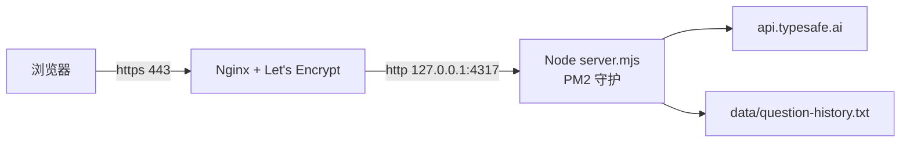

# 部署指南 — 阿里云 ECS

目标架构:浏览器 → Nginx(443,HTTPS)→ 本机 Node(127.0.0.1:4317,PM2 守护)→ TypeSafe API。4317 端口永不对外。



## 前提条件(先做,缺一不可)

1. **ECS 实例**:Ubuntu 22.04 推荐,2C2G 足够(项目零第三方依赖)。
2. **域名解析**:在你的 DNS 服务商把域名 A 记录指向 ECS 公网 IP,等 1~10 分钟生效。
3. **备案(大陆地域)**:域名解析到中国大陆地域服务器必须先完成 ICP 备案,否则阿里云会拦截 80/443 访问。不想备案可把 ECS 开在香港/海外地域(跨境延迟略高)。备案一般需要数天到数周,建议先并行发起。
4. **安全组**:放行 80 与 443(0.0.0.0/0);22 端口建议仅限你自己的 IP。**4317 不要放行**。

## 部署(推荐:一键脚本)

```bash
# 服务器上,先克隆仓库(或上传代码)
git clone https://github.com/Xavierrrr23/triad-personal-decision-terminal.git
cd triad-personal-decision-terminal

# 运行部署脚本(把域名换成你的)
sudo bash deploy/setup.sh triad.example.com your@email.com
```

脚本流程:装依赖 → 装 Node 22 → 拉代码 → 生成 `.env.local`(提示你填入 `TYPESAFE_API_KEY`,填好后重跑脚本)→ 跑测试 → PM2 启动 → Nginx 站点 → certbot 签发 HTTPS。

完成即得 `https://你的域名`。

## 手动部署(想逐步掌控的话)

```bash
# 1. 依赖
sudo apt update && sudo apt install -y nginx certbot git curl
# 2. Node 22(如无)
curl -fsSL https://deb.nodesource.com/setup_22.x | sudo bash - && sudo apt install -y nodejs
# 3. 代码
sudo mkdir -p /opt && sudo git clone https://github.com/Xavierrrr23/triad-personal-decision-terminal.git /opt/triad
# 4. 密钥与配额
sudo vim /opt/triad/.env.local   # 内容见下
sudo chmod 600 /opt/triad/.env.local
# 5. 测试
cd /opt/triad && npm test
# 6. PM2
sudo npm install -g pm2
sudo pm2 start deploy/ecosystem.config.cjs
sudo pm2 save && sudo pm2 startup systemd -u root --hp /root
# 7. Nginx
sudo sed 's/triad\.example\.com/你的域名/g' deploy/nginx.conf | sudo tee /etc/nginx/sites-available/triad
sudo ln -sf /etc/nginx/sites-available/triad /etc/nginx/sites-enabled/triad
sudo rm -f /etc/nginx/sites-enabled/default
sudo mkdir -p /var/www/certbot && sudo nginx -t && sudo systemctl reload nginx
# 8. HTTPS
sudo certbot certonly --webroot -w /var/www/certbot -d 你的域名 -m your@email.com --agree-tos -n
sudo systemctl reload nginx
```

`.env.local` 内容(密钥务必真实,其余按需):

```bash
TYPESAFE_API_KEY=你的TypeSafeKey
PORT=4317
HOST=127.0.0.1
PUBLIC_DAILY_LIMIT=23
TRUST_PROXY=1
```

- `HOST=127.0.0.1` + `TRUST_PROXY=1` 是配套组合:端口只给本机 Nginx 用,配额按 Nginx 传来的 `X-Forwarded-For` 计每个访客 IP。**直接暴露端口时绝不能开 TRUST_PROXY**(头可伪造)。
- `PUBLIC_DAILY_LIMIT=23`:公共终端每 IP 每日 23 次,私人 Key 用户不受限。改数字后 `pm2 restart triad --update-env` 生效(或改 `deploy/ecosystem.config.cjs` 再 `pm2 reload triad`)。

## 日常运维

```bash
pm2 logs triad          # 看日志
pm2 restart triad       # 重启
git -C /opt/triad pull --ff-only && pm2 restart triad   # 更新代码
```

- 改 `decision.mjs` / `roles.json` 无需重启(每次请求按 mtime 热重载)。
- 前端静态资源带 `no-store`,浏览器无需清缓存。
- 证书续期由 certbot 的 systemd 定时器自动执行,`certbot renew --dry-run` 可验证。
- 议案历史在服务器 `/opt/triad/data/question-history.txt`(git 忽略),想备份就备它;想清空 `> data/question-history.txt` 即可。

## 故障排查

| 现象 | 原因与处理 |
|---|---|
| 502 或页面打不开 | Node 没起来或 Key 未配:`pm2 logs triad` 看报错;`curl -s http://localhost:4317/api/health` 看 `configured` |
| 429「今日公共次数已用尽」 | 配额设计行为;用私人 Key,或调大 `PUBLIC_DAILY_LIMIT` |
| certbot 签发失败 | 检查 A 记录是否生效、安全组 80 是否放行、`/var/www/certbot` 是否存在 |
| 手机能开 HTTP 但 HTTPS 证书报错 | 证书域名与访问域名不一致;确认没访问到 IP 直连 |
| 端口被占(EADDRINUSE) | `pm2 status` 看是否已有一份 triad 在跑 |
| 所有访客共用一个配额 | `TRUST_PROXY` 未开,或 Nginx 没配 `X-Forwarded-For`;检查两处 |
